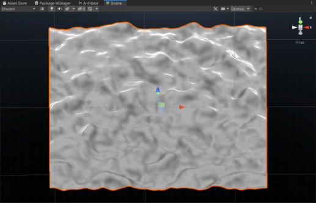

# Survival-Land
A demo game using Unity3D, the game is for the practice of procedural content generation. 

PCG Contents:
All PCG codes can be found in Assets/Project/Scripts/PCG folder.

1.Terrain (Perlin Noise)

The terrain generation involves Map Generator script and Cellular Automata Terrain script. The Map Generator generates 2D noise which represent the height of the terrain, an initial color map and an initial land type map. The map data are done in a thread and are passed to Cellular Automata Terrain script for further processing.

2.Land Type (Cellular Automata)

Once the map mesh is generated, a threaded process in Cellular Automata Terrain script starts to run cellular automata rules to simulate land type transformation. The transformation goes until a maximum of 200 iterations.

3.Cloud System (Cellular Automata)

Cloud system simulates cloud at y value of 70 above the terrain. It is similar to the land type cellular automata except that it simulates the states of each cloud cell frame by frame through out the entire life span of the game.

4.Object Generator (Formal Grammar)

Object generator uses string rules to generate the next group of game objects, each character in the string represent an object. There is a function to read the character and translate it into object type and hence determines what to spawn in the world. On each wave, it uses the last generated string combo as source and calls generate next generation, a new string will be generated from the rules.

5.Mission Generator (L-System)

Mission generator also generates missions through string and rule processing. Like cellular automata land type, I let it run the rules for 10 iterations and generates a long string, and then take a random sub-string of it (currently set sub-string length to 10 characters) and translate them into missions. The mission systems has 2 mission types (major, minor) and 2 mission categories (battle, reconnaissance). Major mission is a must complete, minor mission is optional and has a timer. Minor mission has a timer that states how many longer the mission will persist, the mission gets canceled and a new mission will be filled from mission queue (if any) once the timer count down to 0.

Game Mechanics:

1.Shoot enemy:

Enemies are spawned by the object generator during the game when timer count down to 0. The game will generate a wave of enemies every 5 minutes until the player completes all missions or die. There is a chance to drop treasure chest when an enemy is killed, the treasure chest is also generated through object generator following some Formal Grammar rules.

2.Destroy summoning magic circle:

Magic circles are spawned by the object generator as well in the same manner. The magic circle summons an enemy every minute, and will stay present for the length of the game if not being destroyed. The summoning circle can drop stuff as well, but not necessarily rewards. There is an chance that the magic circle will instantly summon 5 enemies at destruction.

3.Pick up treasure chest:

Player can press ‘F’ to pick up rewards when near a treasure chest with crosshair aiming at the treasure chest. Treasure chest contains First-aid kit and Ammo determined by Formal Grammar rules.

4.Complete missions:

The mission generator generates a bunch of missions, including 2 types of mission, major (must complete), minor (optional), and 2 categories, battle, reconnaissance. Battle missions are like Eliminating enemies and destroying magic circles. Reconnaissance mission is for the player to get to a position and Explore(Press E). The player’s current position is showing at the top-right corner, and we don’t show any marks on map for destination to keep the high difficulty level.

5.Reload ammo:

Player can reload ammo (Press R) when the ammo on hand does not equal to 0. Ammo can be rewarded from either picking up treasure chest or completing mission.

6.Use first-aid kit:

Player can use first-aid kit to recover health when not at full health. Using first-aid kit has a progress time of 4 seconds (with loading bar). Any movement or key press during loading will cancel the action.

7.Lose game:

The game is over when player’s health is reduced to 0. A death screen will be displayed and return to menu scene.

8.Win game:

The only way to win the game is to stay alive and complete all missions. A win screen will be displayed and return to menu scene.

